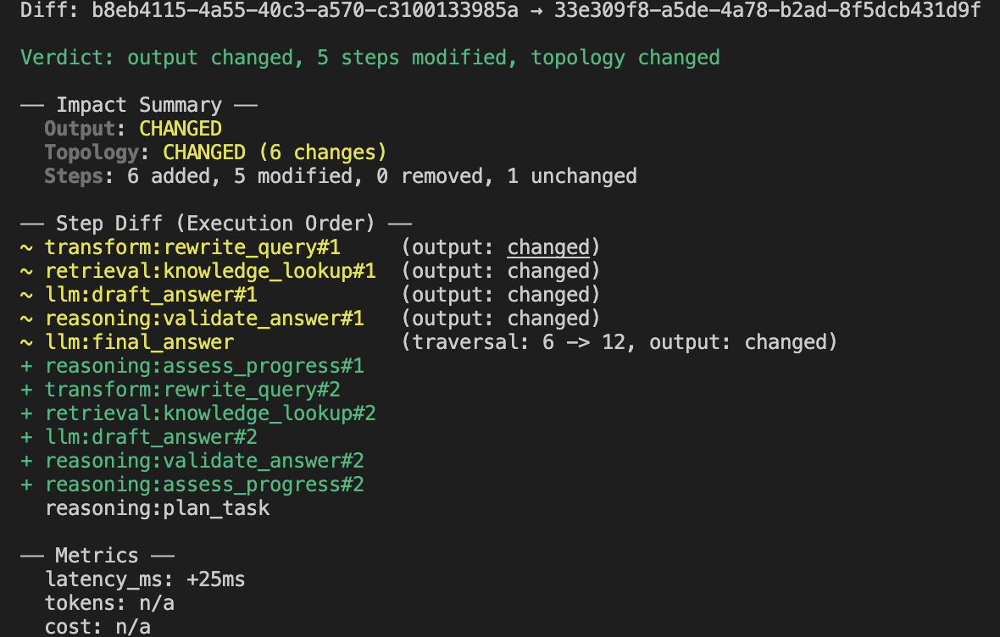
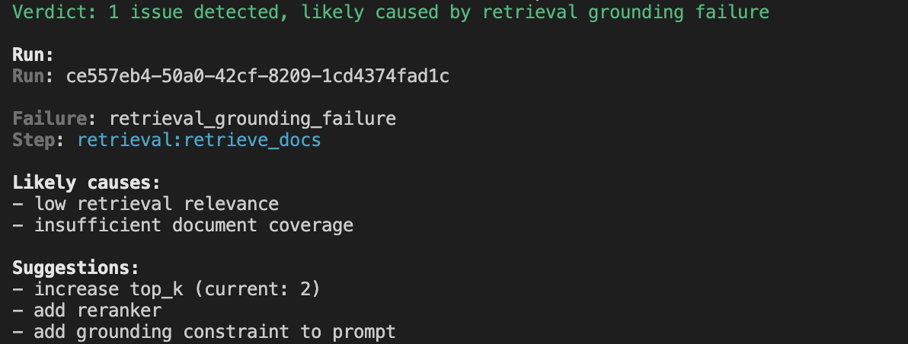

[](https://github.com/notrix-dev/notrix-trax/actions)
[](https://pypi.org/project/notrix-trax/)
[](https://pypi.org/project/notrix-trax/)
[](LICENSE)

# Notrix Trax

**Debug non-deterministic AI workflows — deterministically.**

Trace what happened. Diff what changed. Replay where it broke.


```bash
pip install notrix-trax
```

---

## Why debugging AI systems is broken

You changed nothing. But your AI system behaves differently.

- different answer
- different retrieval
- different agent path

Why?

Logs tell you what ran. They don’t tell you:

- what actually changed
- where the divergence happened
- why the outcome is different

AI systems are **non-deterministic and structurally opaque**.

Debugging them shouldn’t be.

---

## What Trax Does

Trax converts raw execution signals into a **canonical execution graph** — a structured, provider-agnostic DAG of steps and edges with stable identity across runs.

From that graph, Notrix trax provides four core operations:

| Operation | What it answers |
|---|---|
| `inspect` | What happened in this run, structurally? |
| `diff` | What changed between run A and run B? |
| `replay` | Can I simulate replay of the relevant part, safely? |
| `explain` | What is the evidence-grounded explanation for this failure? |

Every insight is derived from the same canonical graph. Nothing is inferred from display hierarchy or log ordering.

---

## When to use Trax

Use Trax if:

- your LLM output changed and you don’t know why
- retrieval returns different documents
- agent behavior is inconsistent

Not for:

- metrics dashboards
- latency monitoring
---

## What you get

- **Deterministic execution graph**
- **Step-level diff between runs**
- **Replay from failure point**
- **Evidence-grounded explanations**

All derived from the same canonical structure.

---

## Trax vs Observability Tools

| Feature | Notrix Trax | Observability tools |
|--------|------|---------------------|
| Structural diff | ✅ | ❌ |
| Replay simulation | ✅ | ❌ |
| Failure explanation | ✅ | ❌ |
| Logs / traces | ❌ | ✅ |

---

## Quickstart

```bash
python examples/hero_diff_replay.py

trax list
trax inspect <run_id>
trax diff <run_a> <run_b>
trax explain <run_id>
trax replay <run_id> --start-at step_4 --stop-at step_8
```

Trax stores metadata in local SQLite and artifacts on the filesystem (`TRAX_HOME`, default: `~/.trax`). No external services required.

---

## Hero Example

Two runs of your RAG pipeline return different answers. You want to know exactly where they diverged.

```bash
trax diff run_1 run_2
```

**See the difference immediately**



```bash
trax explain run_2
```


Structural, grounded, reproducible.

---

## Capture

### Drop-in adapters

```python
from trax.adapters.openai import traced_chat
from trax.adapters.retrieval import traced_retrieval

docs = traced_retrieval(
    query="what is trax?",
    top_k=2,
    backend="simple_vector",
    retrieve=lambda **_: [{"id": "doc-1", "text": "Trax debugs AI runs."}],
)

response = traced_chat(
    model="gpt-4.1-mini",
    messages=[{"role": "user", "content": "Summarize Trax."}],
    call=lambda **_: {"output_text": "Trax is a local-first AI debugger."},
)
```

### Manual SDK

```python
from trax import run, step, traced_step

@traced_step("prepare", attributes={"semantic_type": "transform"})
def prepare_question(text: str) -> dict[str, str]:
    return {"normalized_question": text.strip().lower()}

with run("my-flow", input={"question": "What does Trax do?"}):
    question = prepare_question("What does Trax do?")
    with step("answer", input=question, attributes={"semantic_type": "llm"}) as s:
        s.set_output({"answer": "Trax debugs AI workflows locally."})
```

### LangGraph (first-class support)

Invocation-level and node-level tracing with no dependency on internal callbacks. Works with real compiled graphs.

```python
from trax.langgraph import traced_invoke
from langgraph.graph import StateGraph

graph = StateGraph(MyState)
# ... define nodes and edges ...
compiled = graph.compile()

result = traced_invoke(compiled, {"question": "What does Trax do?"})
```

---

## CLI Reference

```bash
trax list                              # list all captured runs
trax inspect <run_id>                  # inspect a run's canonical graph
trax diff <run_id_1> <run_id_2>        # structural diff between two runs
trax replay <run_id>                   # simulate replay of a run under persisted safety policy
trax replay <run_id> --start-at <step> --stop-at <step>  # partial replay
trax explain <run_id>                  # evidence-grounded failure explanation
trax import-otel trace.json            # import an OpenTelemetry trace
```

---

## How It Works

Trax builds a **canonical execution graph** — not a trace, not a log, not a span tree.

```
Capture → Collect → Normalize → Graph → Diff / Detect / Replay → Explain
```

The key properties that make this useful for debugging:

**Stable step identity.** The same logical step normalizes to the same canonical meaning across runs. This makes structural diffing possible — you're comparing the same thing, not two different representations of it.

**Edge-driven structure.** Relationships between steps are derived from persisted graph edges and deterministic fallback rules. There are no implicit structural relationships from display hierarchy.

**Provider-agnostic adapters.** Different framework or provider integrations emit signals that normalize into the same canonical step model, so diffs and replay stay meaningful across tool boundaries.

**Display hierarchy is not structure.** Scope hints and nesting from adapters are stored as metadata only. They influence how things look, not how the graph is built.

---

## Core Concepts

| Concept | Definition |
|---|---|
| **Run** | A single captured execution instance |
| **Step** | A canonical, normalized unit of work (e.g., `llm:call`, `retrieval:query`) |
| **Edge** | A directional canonical relationship between steps |
| **Artifact** | Input/output data associated with a step |
| **Failure** | A detected issue localized to a specific step in the graph |

Step names follow the format `<domain>:<operation>`. Current surfaced domains include `llm`, `retrieval`, `tool`, `agent`, `reasoning`, `transform`, `io`, `rerank`, and `unknown`.

---

## Examples

| Example | What it demonstrates |
|---|---|
| `examples/basic_capture.py` | Minimal manual SDK capture |
| `examples/rag_failure/` | Retrieval divergence across two runs |
| `examples/agent_loop/` | Structural path divergence in an agent loop |
| `examples/langgraph_basic.py` | Real LangGraph execution with node-level tracing |

```bash
python examples/hero_diff_replay.py
```

---

## Development

```bash
git clone https://github.com/notrix-dev/notrix-trax.git
cd notrix-trax
pip install -e .
pip install -r requirements.txt
pytest
```

See [CONTRIBUTING.md](CONTRIBUTING.md) for how to build adapters, improve the core system, or contribute to the spec.

---

## Project Structure

```
trax/
  adapters/       # capture layer — framework integrations
  normalize/      # canonical step meaning
  graph/          # structural edge construction and validation
  replay/         # deterministic replay engine
  diff/           # two-run structural comparison
  detect/         # single-run failure detection
  cli/            # projection layer

docs/             # system and subsystem specifications
examples/         # runnable demos
```

---

## Spec-Driven Design

Trax is architecture-first. The system behavior is defined in a set of layered specifications:

- `docs/system-spec.md` — authoritative system contract
- `docs/spec-graph.md` — canonical graph model
- `docs/spec-normalizer.md` — step semantics and naming
- `docs/spec-diff-detect.md` — diff and detect contract
- `docs/spec-replay.md` — replay contract
- `docs/spec-adapter.md` — adapter contract

If you want to understand *why* the system is designed the way it is, the specs are the place to start.

---

## License

[Apache License 2.0](LICENSE)
