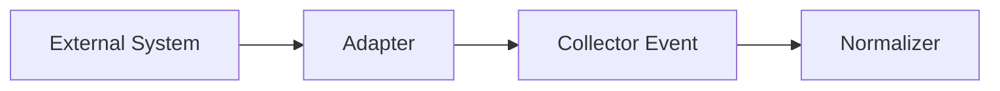
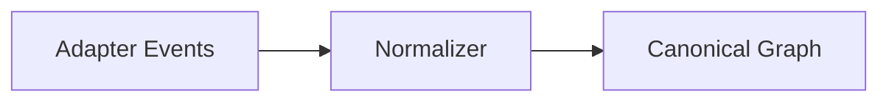

# Notrix Trax — Adapter Specification

**Status:** Stable  
**Version:** 1.0.0  
**Last Updated:** 2026-04-05  
**Maintainers:** Notrix Core Team  
**License:** Apache 2.0

## 1. Purpose

Adapters define how external frameworks, SDKs, and systems emit **capture signals** into Trax.

Adapters MUST:
- emit structured, truthful signals
- avoid embedding interpretation or explanation
- remain normalization-agnostic

Adapters are the **entry boundary** of the Trax system.

---

## 2. Architecture Alignment

External → Adapter → Collector → Normalizer → Persist → Graph → Diff → Replay → Detect → Explain

- Adapters emit **collector events (envelope + payload)**
- Normalizer assigns **canonical meaning**
- Graph defines **structure**

---

## 3. Adapter Classes

### 3.1 Runtime Adapters (default)
Examples: OpenAI wrapper, Retrieval wrapper, LangGraph wrapper

MUST:
- emit capture signals only
- NOT emit canonical graph edges
- NOT assign semantic meaning

### 3.2 Import Adapters (special case)
Example: OpenTelemetry (OTel)

MAY:
- emit **relationship evidence** (e.g., parent/child from spans)

MUST:
- treat emitted relationships as **non-canonical hints**
- NOT bypass normalizer authority
- NOT define final graph structure

---

## 4. Adapter Flow

---

## 5. Collector Event Model

Adapters emit events (not canonical objects):

| Field | Description |
|------|-------------|
| event_kind | step, edge, artifact, etc |
| payload | raw data |
| source_type | adapter type |
| source_name | adapter identity |

Payload MAY include:
- inputs
- outputs
- metadata
- timestamps
- scope hints

---

## 6. Scope Hint

- non-structural metadata
- used as **evidence only**
- never creates edges directly

---

## 7. Adapter Boundaries

Adapters MUST NOT:

- define canonical step names
- define canonical edges (runtime adapters)
- enforce graph structure
- simulate execution
- perform diff/replay logic

---

## 8. Adapter vs Normalizer

---

## 9. Failure & Capture Policy

Adapters SHOULD:
- emit **best-effort signals**
- preserve failure state truthfully
- emit terminal step signals even on exception

Adapters MUST NOT:
- fabricate success
- silently drop failure context

---

## 10. Output Contract

Adapters MUST:
- emit valid collector events
- ensure payload is serializable
- maintain stable structure

---

## 11. Relationship to Other Specs

Depends on:
- terminology.md
- spec-normalizer.md

Feeds into:
- collector
- normalizer

---

## 12. Limitations

- incomplete coverage of external systems
- dependent on instrumentation quality

---

## 13. Future Extensions

- streaming capture
- async tracing
- auto adapter generation
