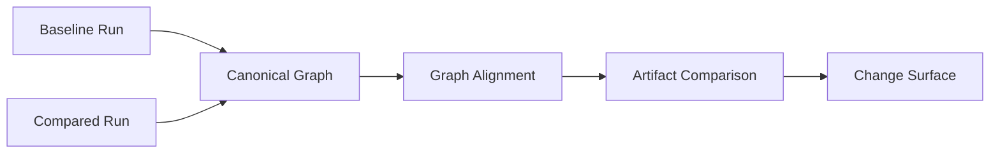
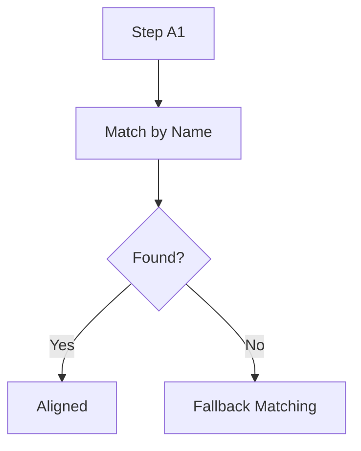
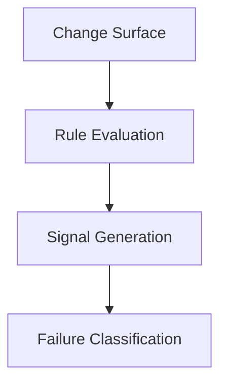

# Notrix Trax — Diff & Detect Specification

**Status:** Stable  
**Version:** 1.0.0  
**Last Updated:** 2026-04-05  
**Maintainers:** Notrix Core Team  
**License:** Apache 2.0

## 1. Purpose

Diff & Detect defines the system for:

- comparing two runs (Diff)
- identifying meaningful deviations (Detect)
- producing structured signals for explanation

This layer transforms raw execution data into **actionable change intelligence**.

---

## 2. Architecture Alignment

Diff & Detect operates after Replay:

Capture → Collect → Normalize → Persist → Graph → Diff → Replay → Explain

- Diff compares **canonical graph + artifacts**
- Detect derives **failures / signals** from graph and artifacts

---

## 3. Core Concepts

| Term | Definition |
|------|------------|
| Baseline run | Reference run |
| Compared run | Target run |
| Change surface | All detected differences |
| Signal | Structured indication of meaningful change |
| Failure | A signal that violates expected behavior |

---

## 4. Diff Flow (Diagram)

---

## 5. Diff Dimensions

Diff operates across 3 layers:

### 5.1 Graph Diff
- step existence (added / removed)
- edge changes
- structure shifts

### 5.2 Artifact Diff
- input/output changes
- value differences
- semantic drift

### 5.3 Execution Diff
- step ordering differences
- missing execution paths

---

## 6. Alignment Strategy

Steps are aligned by:

1. canonical step name
2. structural position
3. fallback ordering

---

## 7. Change Surface

Change surface includes:

- added steps
- removed steps
- modified artifacts
- structural changes

Output MUST be structured and deterministic.

---

## 8. Detect Layer

Detect transforms change surface into signals.

---

## 9. Signal Types

Current v1 surfaced detector signal types are:

| Type | Description |
|------|-------------|
| missing_output | run or step output artifact reference is missing, or a referenced output artifact is missing from storage |
| empty_retrieval | retrieval step completed but returned no documents |
| loop_detected | repeated step pattern detected within the canonical graph |
| latency_anomaly | run or step duration exceeded the current local anomaly threshold |

These are the current product-facing, persisted failure kinds.
Broader abstract diff signals such as structural change or dependency shift may still exist conceptually in the change surface, but they are not currently surfaced as first-class detector kinds in v1.

---

## 10. Failure Semantics

A failure MUST:

- be deterministic
- be reproducible from diff
- reference specific steps

Failures are NOT subjective interpretations.

---

## 11. Detection Rules

Rules operate on:

- step-level changes
- artifact deltas
- dependency paths

Example:

IF retrieval output changes  
AND downstream LLM output changes  
THEN signal dependency_shift

---

## 12. Constraints

Diff & Detect MUST NOT:

- infer causality without evidence
- modify graph
- rely on external systems
- introduce non-determinism

---

## 13. Output Contract

Diff produces:

- change surface

Detect produces:

- signals
- failures

Outputs MUST be machine-readable.

---

## 14. Relationship to Other Specs

Depends on:

- spec-graph (structure)
- spec-replay (state consistency)
- terminology.md (definitions)

Feeds into:

- explain (human-readable reasoning)

---

## 15. Limitations

- no semantic understanding beyond artifacts
- limited causal inference
- dependent on artifact completeness

---

## 16. Future Extensions

- semantic diff (embedding-based)
- probabilistic causality
- multi-run comparison
- anomaly detection
