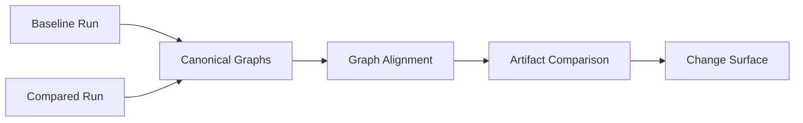
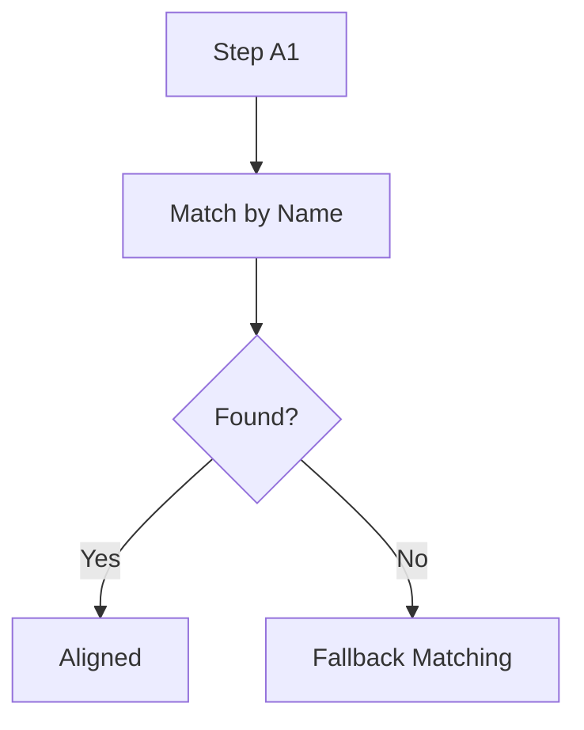
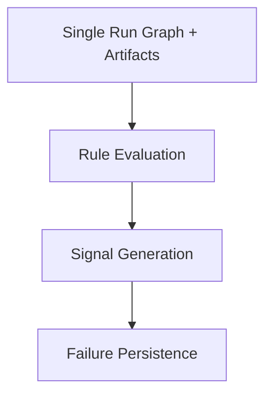

# Notrix Trax — Diff & Detect Specification

**Status:** Stable  
**Version:** 1.0.0  
**Last Updated:** 2026-04-06  
**Maintainers:** Notrix Core Team  
**License:** Apache 2.0

---

## 1. Purpose

This document defines two **separate but related subsystems**:

- **Diff** — two-run comparison producing a structured **change surface**
- **Detect** — single-run analysis producing **failures/signals** from one run’s graph + artifacts

Together they provide inputs for **Explain**, but they are **not dependent on each other** in v1.

---

## 2. Architecture Alignment

Current system topology:

Capture → Collect → Normalize → Persist → Graph  
             ↘ Diff (2-run)  
             ↘ Detect (1-run)  
             ↘ Replay (1-run simulation)  
                        ↘ Explain

- **Diff, Detect, Replay are parallel consumers** of canonical graph + artifacts
- Detect does **NOT** require Diff or Replay
- Explain may consume outputs from any of the above

---

## 3. Core Concepts

| Term | Definition |
|------|------------|
| Baseline run | Reference run (Diff only) |
| Compared run | Target run (Diff only) |
| Change surface | Structured differences between two runs (Diff output) |
| Signal | Structured indicator of a condition (Detect output) |
| Failure | A persisted signal representing a violated invariant (Detect output) |

---

# PART A — DIFF (Two-Run)

## 4. Diff Flow (Diagram)

---

## 5. Diff Dimensions

### 5.1 Graph Diff
- step added / removed
- edge changes
- structure shifts

### 5.2 Artifact Diff
- input/output differences
- value changes
- semantic drift (non-interpretive)

### 5.3 Execution Diff
- ordering differences
- path divergence

---

## 6. Alignment Strategy

Priority:
1. canonical step name
2. structural position
3. stable fallback ordering

---

## 7. Diff Output

Diff produces:

- change surface (structured)
- no interpretation
- no failures

Diff is **pure comparison**, not analysis.

---

# PART B — DETECT (Single-Run)

## 8. Detect Flow (Diagram)

---

## 9. Detect Inputs

Detect operates on:

- canonical graph (steps + edges)
- artifacts (inputs/outputs)
- execution metadata (timing, repetition)

Detect does **NOT** consume:
- diff output
- replay output (v1)

---

## 10. Signal Types (v1)

Current surfaced detector kinds:

| Type | Description |
|------|-------------|
| missing_output | missing output artifact |
| empty_retrieval | retrieval returned no documents |
| loop_detected | repeated step pattern |
| latency_anomaly | duration exceeds threshold |

These are **single-run derived failures**.

---

## 11. Failure Semantics

A failure MUST:

- be deterministic
- be reproducible from **single-run graph + artifacts**
- reference specific steps

Failures are NOT:
- diff-derived (in v1)
- causal explanations
- probabilistic guesses

---

## 12. Detection Rules

Rules operate on:

- step artifacts
- graph structure
- execution patterns

### Example Rules

**Empty Retrieval**
IF retrieval step outputs empty documents  
THEN emit empty_retrieval

**Loop Detection**
IF repeating step pattern exceeds threshold  
THEN emit loop_detected

**Latency**
IF step duration exceeds threshold  
THEN emit latency_anomaly

---

## 13. Constraints

Detect MUST NOT:

- require multi-run comparison
- infer causality beyond evidence
- modify graph
- depend on replay

---

## 14. Output Contract

Diff produces:
- change surface

Detect produces:
- signals
- persisted failures

Outputs MUST be:
- deterministic
- machine-readable

---

## 15. Relationship to Other Specs

Depends on:
- spec-graph (structure)
- terminology.md (definitions)

Independent of:
- spec-replay (v1)

Feeds into:
- explain (interpretation layer)

---

## 16. Limitations

- Detect is single-run only (v1)
- No causal inference
- No cross-run reasoning

---

## 17. Future Extensions

- diff-derived signals (dependency_shift, structural_change)
- causal chain reconstruction
- replay-assisted detection
- multi-run anomaly detection

