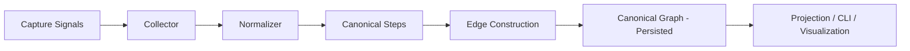
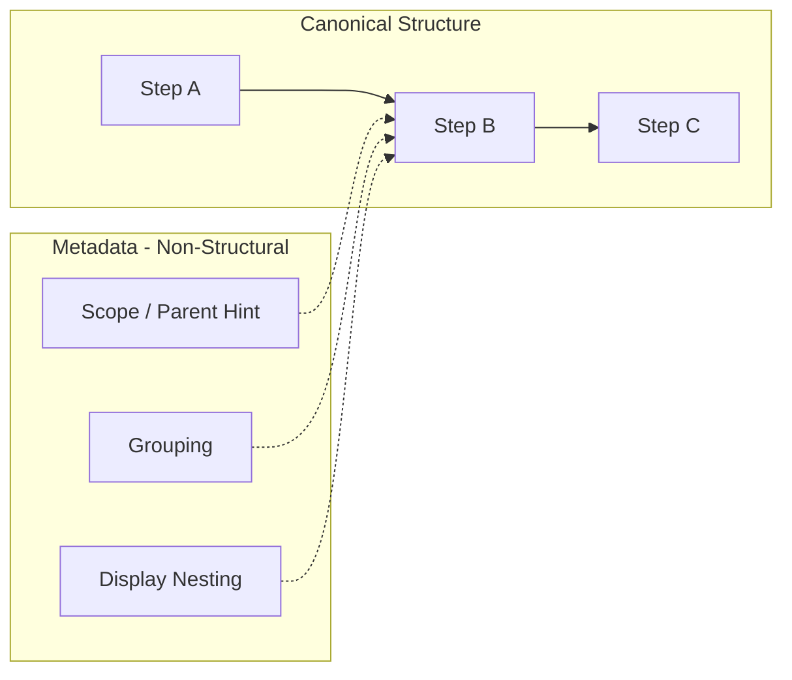

# Notrix Trax - Graph Specification

**Status:** Stable <br>
**Version:** 1.0.0 <br>
**Last Updated:** 2026-04-05 <br>
**Maintainers:** Notrix Core Team <br>
**License:** Apache 2.0

---
## 1. Purpose

This document defines the **canonical execution graph model** used by Notrix Trax.

It specifies:

* what constitutes **structural truth**
* how execution is represented as a graph
* what data is **authoritative vs non-authoritative**
* the invariants required for diff, replay, and explain

This is a **storage and query model**, not a UI or visualization spec.

---

## 2. Core Principle

> **Normalization defines meaning. Edges define structure. Projection defines experience.**

Implications:

* Step meaning is determined only by the **normalizer**
* Graph structure is determined only by **edges**
* Display hierarchy (nesting, grouping) is **non-canonical**

---

## 3. System Flow

### Diagram: From capture signals to canonical graph



### Explanation

* **Capture signals** originate from SDKs, adapters, or instrumentation
* **Collector** aggregates raw signals
* **Normalizer** defines canonical step meaning
* **Edge construction** defines relationships between steps
* **Persisted graph** is the single source of truth
* **Projection** renders display views (non-authoritative)

---

## 4. Core Entities

### Run

A single execution instance.

### Step

A canonical unit of execution with normalized meaning.

### Edge

A directional relationship between steps representing structural truth.

### Artifact

Input/output data associated with steps (non-structural).

### Failure

A detected issue derived from graph + artifacts (non-structural).

---

## 5. Graph Truth Model

### Canonical Truth

The execution graph is defined **only** by:

* Steps (nodes)
* Edges (relationships)

> **Edges are the only source of structural truth.**

---

### Non-Structural Data

The following do **not** define graph structure:

* `scope_parent_step_id`
* nesting / grouping
* display hierarchy
* adapter-emitted parent relationships

These are treated as **metadata only**.

---

## 6. Truth vs Metadata

### Diagram: Structural truth vs metadata



### Explanation

* Solid edges represent **canonical structure**
* Dashed relationships represent **metadata only**
* Metadata may influence **projection**, but never structure

---

## 7. Step Semantics

Step meaning is defined exclusively by the **normalizer**.

### Canonical naming format

```
<semantic_type>:<operation>
```

### Examples

* `llm:call`
* `retrieval:query`
* `tool:invoke`
* `agent:node`

### Rules

* names are **stable and immutable**
* no persisted suffixes (`#1`, `#2`)
* provider-specific details are removed
* meaning is **provider-agnostic**

---

## 8. Edge Construction Rules

Edges are constructed deterministically using the following priority:

1. **Dependency evidence**
2. **Semantic relationship**
3. **Fallback `control_flow`**

### Definitions

* **Dependency evidence**
  Explicit data dependency between steps

* **Semantic relationship**
  Known relationship based on step types, explicit import parent_child edges when present

* **Fallback control_flow**
  Fallback control_flow edges from normalization

> Fallback edges are **canonical**, not display-only.

---

## 9. Invariants

The graph must satisfy:

* structure is derived **only from edges**
* graph is validated from **persisted edges**
* graph is **DAG-safe per run**
* step identity is **stable across runs**
* metadata never creates structural edges
* fallback edges are valid canonical edges

---

## 10. Capture Modes

The graph model must support:

### Passive-only

* structure from dependency + fallback

### Explicit-only

* structure from fallback edges

### Hybrid

* both coexist
* stronger evidence takes precedence
* no structural leakage from scope

---

## 11. Non-Goals

This spec does **not** define:

* UI visualization
* span trees or tracing hierarchies
* LangGraph topology import
* full semantic causality inference

---

## 12. Worked Example (Minimal)

```text
Capture Signals:
- retrieve_docs()
- call_llm()
- invoke_tool()

Normalized Steps:
- retrieval:query
- llm:call
- tool:invoke

Edges:
retrieval:query → llm:call → tool:invoke
```

---

## 13. Why This Matters

This graph model enables:

* **Deterministic replay**
* **Stable diff across runs**
* **Accurate failure detection**
* **Evidence-based explanation**

Without a canonical, edge-driven graph:

* replay becomes unsafe
* diff becomes inconsistent
* explanations lose grounding

---

## Final Statement

> The execution graph is the **source of truth** in Trax.
> Everything else—display, explanation, and experience—is derived from it.
