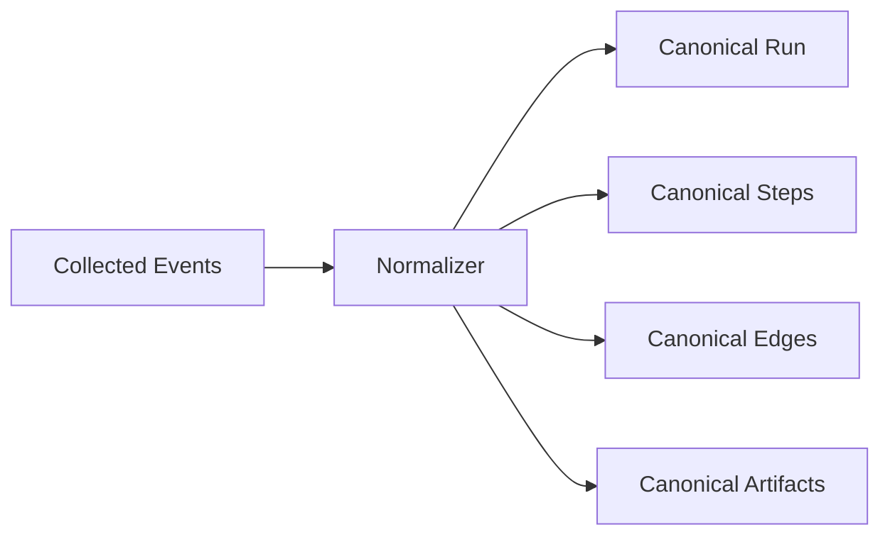
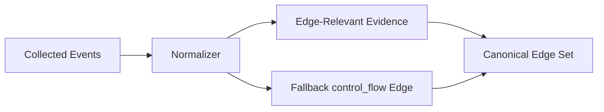
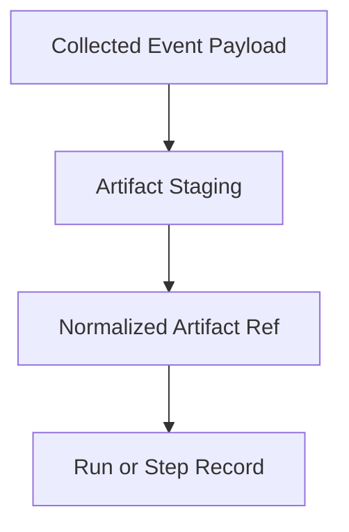

# Notrix Trax — Normalizer Specification

**Status:** Stable  
**Version:** 1.1.0  
**Last Updated:** 2026-04-06  
**Maintainers:** Notrix Core Team  
**License:** Apache 2.0

---

## 1. Purpose

This document defines the **Normalizer** as the component that converts collected capture events into canonical Trax domain records.

The Normalizer is the **semantic authority** of the system.

It is responsible for:

- assigning canonical step meaning
- mapping framework-specific payloads into Trax records
- normalizing safety and artifact references
- constructing canonical fallback `control_flow` edges where required by v1.5
- preserving source facts while preventing source-specific semantics from leaking into canonical truth

The Normalizer MUST NOT:

- bypass the collector boundary
- invent source facts not present in collected events
- act as a diff, replay, or explanation engine
- allow adapters or SDKs to directly define canonical semantics

---

## 2. Architecture Alignment

The Normalizer sits in the canonical system path:

```text
Capture → Collect → Normalize → Persist → Graph → Diff → Replay → Detect → Explain
```


The Normalizer:

- consumes **CollectedEvent** records
- produces canonical `Run`, `Step`, `Edge`, and `Artifact` records
- may produce normalized failure-like inputs only when imported as source evidence
- does **not** persist Explanation output

---

## 3. Core Principle

> **Collector preserves source facts.  
> Normalizer assigns Trax meaning.  
> Edges define structure.**

Implications:

- source payloads remain source-shaped until normalization
- adapters and SDKs may provide hints, but not canonical meaning
- canonical step names and normalized fields are assigned only here
- canonical records produced by the Normalizer are the valid inputs to Graph, Diff, Replay, Detect, and Explain


---

## 4. Normalization Boundary (Diagram)



### Explanation

- **Collected Events** preserve source facts and envelope metadata
- **Normalizer** resolves those facts into canonical domain records
- downstream engines operate on canonical records only

---

## 5. Inputs and Outputs

### 5.1 Inputs

The Normalizer consumes:

- collected events
- staged artifact metadata
- source metadata
- capture policy information
- ordering metadata when available

Collected events are implementation-shaped envelopes, not canonical records.

A collected event may include:

- `event_kind`
- `payload`
- `source_type`
- `source_name`
- run and step hints
- occurrence timestamp
- capture policy

The collector event envelope is defined at the architecture layer, not by this document.

### 5.2 Outputs

The Normalizer may emit:

- `Run`
- `Step`
- `Edge`
- `Artifact`

The Normalizer MAY also surface imported detector-like source evidence as normalized failure inputs where explicitly supported.

The Normalizer MUST NOT emit:

- persisted explanations
- diff output
- replay results

---

## 6. Responsibilities

The Normalizer MUST:

1. map source/framework operations into canonical step names and fields
2. assign normalized step type / name
3. assign normalized `safety_level`
4. normalize artifact references
5. preserve source metadata in normalized non-canonical fields when possible
6. validate per-run consistency before canonical persistence
7. preserve deterministic behavior given the same inputs
8. construct canonical fallback `control_flow` edges when stronger evidence is absent and ordering is unambiguous

The Normalizer MUST NOT:

- directly trust framework naming as canonical naming
- use projection hierarchy as structural truth
- rely on probabilistic or LLM-based inference
- create explanation text
- mutate already persisted canonical truth retroactively

---

## 7. Canonical Naming

Canonical step naming follows:

```text
<semantic_type>:<operation>
```

### Canonical semantic domains currently supported in v1.5

- `llm`
- `retrieval`
- `tool`
- `agent`
- `unknown`

Representative canonical names include:

- `llm:call`
- `retrieval:query`
- `tool:invoke`
- `agent:node`
- `unknown:<operation>`

These align with the currently implemented fallback/default normalization domains. f

### Naming Rules

1. names MUST be lowercase and colon-separated
2. names MUST be provider-agnostic
3. names MUST NOT include positional suffixes in persisted form
4. names MUST remain stable across runs for the same logical operation
5. names MUST be assigned by normalization, not by adapters or SDKs

### Unknown / Unmapped Operations

If a source operation cannot be mapped to a supported semantic pattern, the Normalizer MUST assign a conservative fallback canonical name.

Recommended fallback:

```text
unknown:<operation>
```

The goal is to preserve visibility without overstating semantic certainty.

---

## 8. Semantic Mapping Rules

The Normalizer is responsible for collapsing source-specific semantics into Trax semantics.

Examples:

| Source signal | Canonical result |
|---|---|
| OpenAI chat/completion call | `llm:call` |
| Vector or document retrieval | `retrieval:query` |
| Tool execution wrapper | `tool:invoke` |
| LangGraph node invoke | `agent:node` |

### Mapping Constraints

Semantic mapping MUST be:

- deterministic
- rule-based
- inspectable

Semantic mapping MUST NOT be:

- probabilistic
- hidden heuristic behavior
- dependent on projection or UI nesting

This document does not claim broader semantic domains are normalized today beyond the currently implemented v1.5 surface.

---

## 9. Normalization of Scope and Metadata

### 9.1 Scope Hints

Source events may include scope hints such as:

- `scope_parent_step_id`
- parent-like span references
- framework nesting/grouping hints

These are **non-structural metadata only**.

The Normalizer MUST:

- preserve them when useful for later projection or diagnostics
- store them as metadata or normalized scope fields

The Normalizer MUST NOT:

- convert scope hints into canonical structural truth by themselves
- treat nesting as an edge
- derive parent-child hierarchy solely from scope hints

### 9.2 Source Metadata

The Normalizer MAY preserve normalized source metadata, but current preservation is lossy and implementation-shaped.

Examples of source-origin normalization may include:
- preserving known explicit source labels
- mapping ergonomic capture to explicit origin
- treating import surfaces specially
- falling back to `unknown` when no stable normalized origin is available

Source metadata remains **non-canonical**, unless explicitly promoted into a normalized canonical field.

---

## 10. Edges and Edge-Relevant Evidence

The Normalizer participates in edge construction in a limited but real way in v1.5.

It may consume and classify:

- explicit dependency references
- imported relationship evidence
- semantic sequencing hints
- ordered step completion facts

It also currently constructs canonical fallback `control_flow` edges when stronger evidence is absent and execution ordering is unambiguous. 



### Rules

- imported relationship evidence is not automatically canonical truth
- source parent/child relationships remain evidence unless promoted by normalization rules
- scope hints alone MUST NOT create canonical edges
- fallback `control_flow` edges MAY be created directly by normalization in v1.5
- stronger evidence should take precedence over fallback

This preserves the architectural rule that edges are the structural truth of the system.

---

## 11. Safety Level Normalization

The Normalizer MUST assign a normalized `safety_level` for each step.

### Currently supported normalized values in implementation

- `safe_read`
- `unsafe_write`
- `unknown`

Replay policy depends on these normalized values, so this vocabulary MUST match implementation. 

### Rules

1. if source declares a recognized safe read value, normalize to `safe_read`
2. if source declares a recognized unsafe mutating value, normalize to `unsafe_write`
3. if safety cannot be established, default to `unknown`
4. normalization MUST be deterministic
5. the Normalizer MUST NOT silently upgrade unsafe behavior into safer behavior

### Purpose

This field exists primarily to support replay policy and safe-by-default simulation.

---

## 12. Artifact Normalization

Artifacts may exist at either:

- run scope
- step scope

The Normalizer MUST normalize artifact references so that downstream engines can depend on stable canonical linkage.

### Artifact Rules

- artifacts are referenced, not embedded as canonical row payloads
- artifacts remain immutable for completed runs
- run-level artifacts are valid canonical artifacts
- step-level input/output artifacts are valid canonical artifacts
- capture policy may affect payload persistence depth, but MUST NOT corrupt canonical linkage

### Artifact Linking (Diagram)



---

## 13. Per-Run Consistency Rules

Normalization occurs within per-run consistency boundaries.

The Normalizer MUST ensure:

- all emitted steps belong to the same canonical run
- all emitted edges connect steps within the same run
- artifact refs are linked coherently
- step statuses and timestamps are coherent enough for downstream graph validation

The Normalizer SHOULD reject or quarantine events that would create structurally inconsistent canonical state.

---

## 14. Determinism and Idempotence

Normalization MUST be deterministic.

Given the same collected inputs, the Normalizer MUST produce the same canonical outputs.

Normalization SHOULD also be idempotent at the persistence boundary, meaning repeated normalization of the same collected event set should not produce duplicate canonical records.

### Same-Batch Dedup

Where repeated source events would otherwise produce duplicate semantic noise, the Normalizer MAY apply conservative same-batch deduplication, provided it does not collapse distinct logical steps. 

---

## 15. Validation and Failure Behavior

### 15.1 Validation Responsibilities

The Normalizer MUST validate:

- required fields for canonical record creation
- mapping validity
- safety level normalization
- artifact linkage sanity
- per-run coherence

### 15.2 Failure Modes

When normalization cannot proceed safely, the system SHOULD prefer one of:

1. **quarantine** malformed source events with diagnostics
2. **emit conservative fallback canonical meaning**
3. **fail clearly in strict mode**

The Normalizer MUST NOT:

- silently fabricate canonical meaning
- silently create structurally invalid records
- silently discard conflicts that change canonical truth

---

## 16. Relationship to Other Specs

Depends on:

- `terminology.md`
- `spec-adapter.md`

Feeds into:

- `spec-graph.md`
- `spec-replay.md`
- `spec-diff-detect.md`

### Responsibility Boundary

- **Adapter** defines how source signals are emitted
- **Normalizer** defines how source signals become canonical meaning and may construct fallback edges in v1.5
- **Graph** defines structural truth over the canonical edge set

---

## 17. Non-Goals

This specification does **not** define:

- replay policy behavior in full
- diff matching rules
- explanation generation
- UI projection
- persistence backend details

Those belong to other specifications.

---

## 18. Worked Example

### Source Inputs

A LangGraph wrapper emits:

- `event_kind = step_end`
- `source_name = langgraph`
- `payload.node_name = retrieve_docs`
- `payload.inputs = {...}`
- `payload.outputs = {...}`
- `scope_parent_step_id = step_1`

### Normalization Result

- Step name: `agent:node`
- Source metadata preserved in normalized non-canonical form when possible
- Artifact refs created for input/output payloads
- No canonical edge created solely from `scope_parent_step_id`

### Why

- step meaning belongs to normalization
- structure belongs to the canonical edge set
- scope remains metadata only

---

## 19. Final Statement

> The Normalizer is the semantic contract of Trax.  
> It preserves source facts, assigns canonical meaning, normalizes safety and artifacts, and may construct canonical fallback control-flow edges when required.
