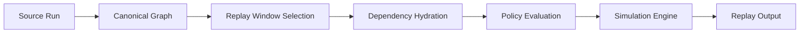
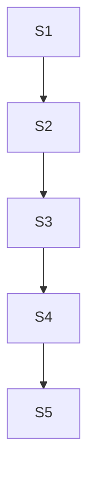
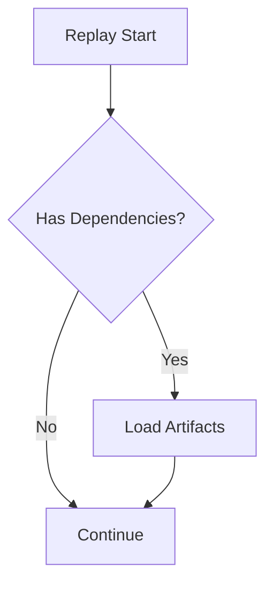
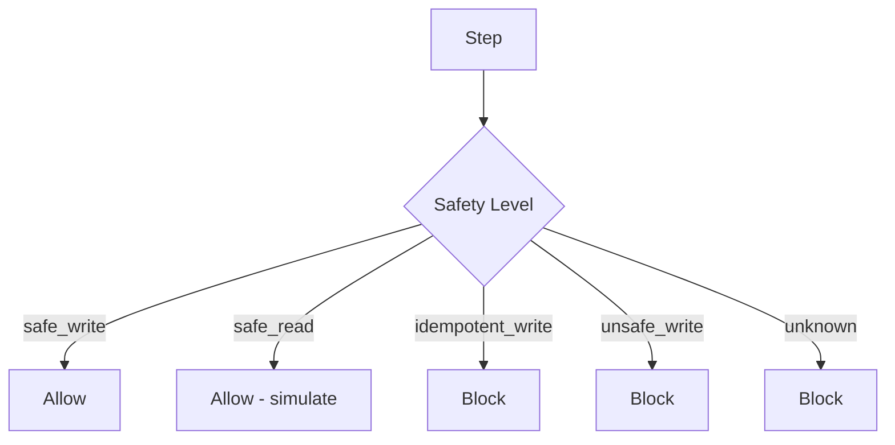

# Notrix Trax — Replay Specification

**Status:** Stable  
**Version:** 1.0.0  
**Last Updated:** 2026-04-05  
**Maintainers:** Notrix Core Team  
**License:** Apache 2.0

## 1. Purpose

Replay defines the **artifact-backed simulation model** over a canonical graph.

Replay MUST:
- preserve original execution structure
- simulate behavior using recorded artifacts
- allow partial execution (windowed replay)

Replay operates strictly on the canonical graph defined in `docs/spec-graph.md`.

---

## 2. Architecture Alignment

Replay is defined within the Trax system pipeline:
```
Capture → Collect → Normalize → Persist → Graph → Diff → Replay → Detect → Explain 
```
Replay is:
- a **consumer of canonical graph truth**
- a **simulation engine**, not a live execution engine
- constrained by **safety policy**

---

## 3. Replay Flow (Diagram)



---

## 4. Core Principles

R-1 Simulation First  
Replay MUST use recorded artifacts, not live execution.

R-2 Graph-Driven  
Replay MUST follow canonical graph structure.

R-3 Deterministic Behavior  
Replay MUST produce consistent outputs given identical artifacts.

R-4 Safe by Default  
Unsafe or unknown steps MUST be blocked.

---

## 5. Replay Window

Replay MAY be partial.



Example:
Replay from S3:

- S1, S2 → hydrated
- S3, S4 → simulated
- S5 → skipped

---

## 6. Step Classification

| Type | Description |
|------|-------------|
| SIMULATED | Behavior reconstructed from artifacts |
| SKIPPED | Not required for replay |
| BLOCKED | Blocked for replay |

---

## 7. Dependency Hydration (Diagram)



---

## 8. Replay Control Policy

Replay MUST enforce safety using `safety_level`.

### Safety Levels

| Level | Behavior |
|------|---------|
| safe_write | allowed |
| safe_read | allowed (simulation only) |
| idempotent_write | blocked in current version |
| unsafe_write | blocked |
| unknown | blocked |

---

### Replay Modes
| Mode | Behavior |
|------|---------|
| inspect | no execution |
| simulate | mocked |
| shadow | read-only execution |
| live | real execution with safeguards |

*inspect, shadow, live are features in progress*

### Default Policy
- unsafe_write → BLOCKED
- unknown → BLOCKED


## 9. Policy Evaluation (Diagram)



---

## 10. Replay Constraints

Replay MUST NOT:
- modify graph structure
- introduce new steps
- execute external side effects
- bypass safety policy

---

## 11. Replay Output

Replay produces:

- simulated step outputs
- policy decisions (allowed/blocked)
- hydrated dependencies
- replay summary

Replay output is **derived**, not persisted.

---

## 12. Relationship to Architecture

Replay depends on:

- canonical graph (graph module)
- artifacts (storage layer)
- safety_level (step schema)
- policy rules (engine)


---

## 13. Limitations

- no live execution
- no external system interaction
- no guarantee for non-deterministic steps
- dependent on artifact completeness

---

## 14. Future Extensions

- live replay mode
- shadow execution
- sandbox adapters
- external system mocking
