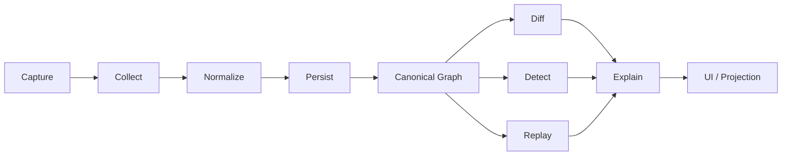
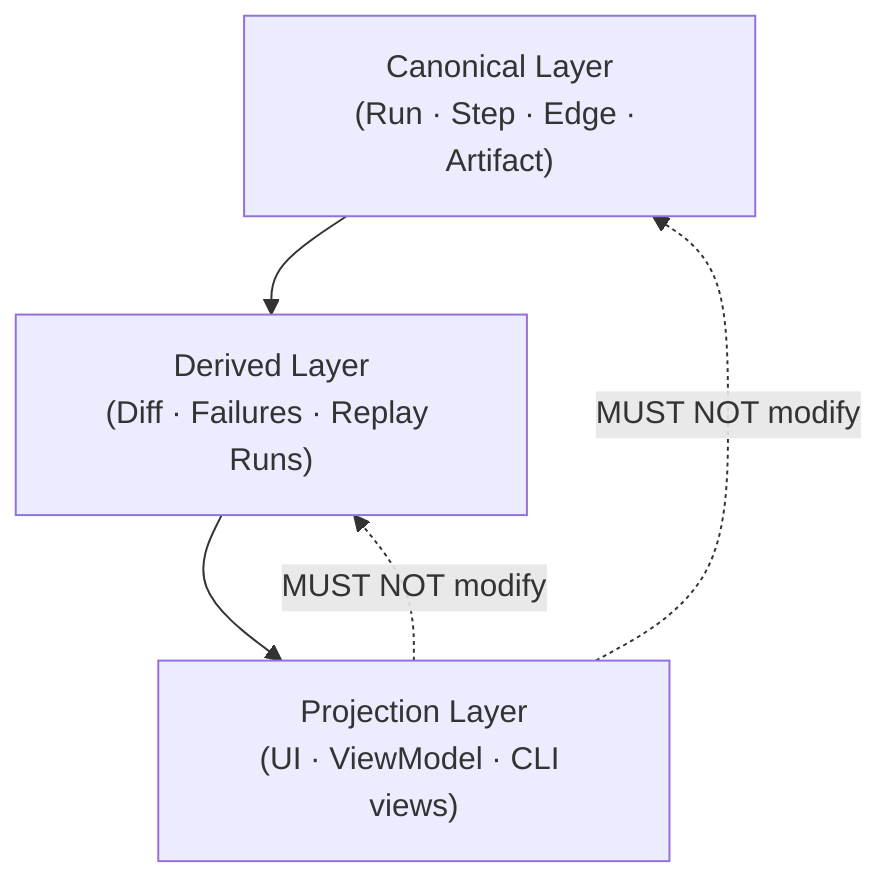
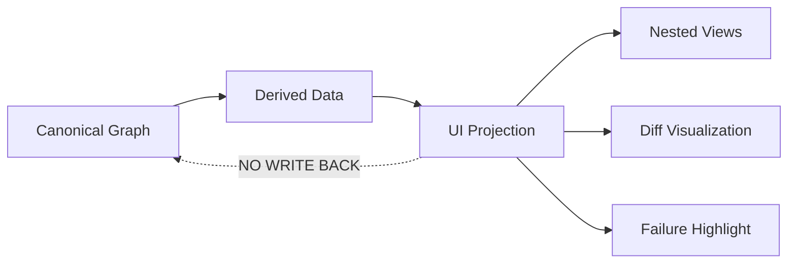
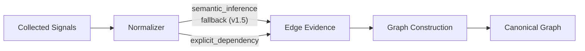
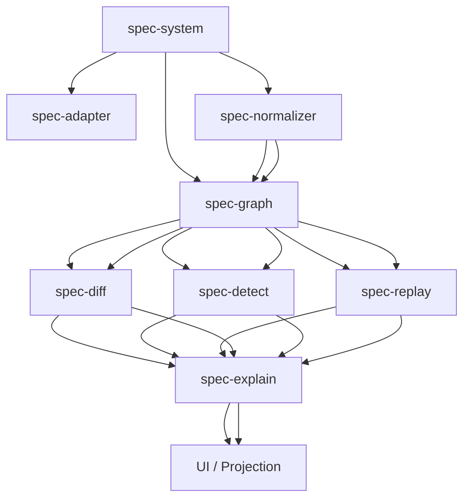

# Notrix Trax — System Specification

**Status:** Stable <br>
**Version:** 1.0.0 <br>
**Last Updated:** 2026-04-06 <br>
**Maintainers:** Notrix Core Team <br>
**License:** Apache 2.0

---

## Table of Contents

1. [Purpose](#1-purpose)
2. [System Definition](#2-system-definition)
3. [Background and Motivation](#3-background-and-motivation)
4. [Core Principles](#4-core-principles)
5. [Terminology](#5-terminology)
6. [End-to-End Pipeline](#6-end-to-end-pipeline)
   - 6.1 [Pipeline Overview](#61-pipeline-overview)
   - 6.2 [Key Topological Properties](#62-key-topological-properties)
7. [Layer Model](#7-layer-model)
   - 7.1 [Three-Layer Separation](#71-three-layer-separation)
   - 7.2 [Canonical Layer](#72-canonical-layer)
   - 7.3 [Derived Layer](#73-derived-layer)
   - 7.4 [Projection Layer](#74-projection-layer)
   - 7.5 [Hard Rule: No Write-Back](#75-hard-rule-no-write-back)
8. [Subsystem Responsibility Map](#8-subsystem-responsibility-map)
9. [Subsystem Boundary Rules](#9-subsystem-boundary-rules)
   - 9.1 [Adapter](#91-adapter)
   - 9.2 [Normalizer](#92-normalizer)
   - 9.3 [Graph](#93-graph)
   - 9.4 [Detect](#94-detect)
   - 9.5 [Diff](#95-diff)
   - 9.6 [Replay](#96-replay)
   - 9.7 [Explain](#97-explain)
   - 9.8 [UI](#98-ui)
10. [Edge Authority Model](#10-edge-authority-model)
    - 10.1 [Priority Rules](#101-priority-rules)
    - 10.2 [Authority Assignment](#102-authority-assignment)
11. [System Policies](#11-system-policies)
    - 11.1 [Determinism Policy](#111-determinism-policy)
    - 11.2 [Safety Policy](#112-safety-policy)
    - 11.3 [Truth Hierarchy](#113-truth-hierarchy)
12. [Data Flow Invariants](#12-data-flow-invariants)
13. [Execution Modes](#13-execution-modes)
14. [Spec Dependency Graph](#14-spec-dependency-graph)
15. [Known Constraints](#15-known-constraints)
16. [Future Evolution](#16-future-evolution)
    - 16.1 [Semantic Expansion](#161-semantic-expansion)
    - 16.2 [Edge Authority Refactor](#162-edge-authority-refactor)
    - 16.3 [Detection Evolution](#163-detection-evolution)
    - 16.4 [Replay Safety](#164-replay-safety)
    - 16.5 [Explain Engine](#165-explain-engine)
    - 16.6 [UI Evolution](#166-ui-evolution)
17. [Conformance](#17-conformance)
18. [Non-Goals](#18-non-goals)
19. [Changelog](#19-changelog)

---

## 1. Purpose

This document defines **Notrix Trax as a complete system**, establishing:

- The end-to-end execution model from raw capture signals to explanation
- Subsystem boundaries and their contracts with each other
- The canonical, derived, and projection layer separation
- System-wide invariants, policies, and conformance requirements

> This is the **authoritative system contract**.
> All subsystem specifications MUST conform to this document.
> Where subsystem specs conflict with this document, this document takes precedence.

This specification is intentionally decoupled from implementation details, storage backends, and UI rendering decisions. It defines *what* the system does and *how subsystems must relate to each other* — not *how* any individual component is internally implemented.

---

## 2. System Definition

Trax is a:

> **Canonical execution intelligence system** that converts runtime signals into structured, replayable, and explainable execution truth.

More precisely, Trax is responsible for:

1. **Capturing** raw execution signals from AI workloads
2. **Normalizing** those signals into a canonical, provider-agnostic graph
3. **Persisting** that graph as the durable source of truth
4. **Deriving** structured insights (diffs, failures, replays) from the canonical graph
5. **Projecting** those insights into human-readable or machine-readable views

Every component in the system exists to serve one of these five responsibilities. Components that do not fit into this taxonomy are out of scope.

---

## 3. Background and Motivation

AI workloads — particularly those involving LLM calls, retrieval pipelines, and tool-use chains — produce rich execution traces. Naïvely treating these traces as flat logs or span trees (borrowed from traditional distributed tracing) produces fragile representations that are difficult to diff, replay, or explain accurately.

Notrix Trax solves this by grounding all execution representation in a **canonical graph model** with clearly defined structural truth. This yields:

- **Deterministic replay analysis**: the same canonical graph and artifacts always produce the same replay result
- **Stable diff**: graph comparisons are structurally meaningful across runs
- **Accurate failure attribution**: failures are localized to graph structure, not display artifacts
- **Evidence-based explanation**: explanations are grounded in canonical graph structure and persisted artifacts

The central insight is that **display hierarchy is not structure**, and **derived insights are not truth**. Parent-child nesting from span trees, scope hints, and UI groupings are useful for visualization but must never define or modify the underlying execution model. This spec enforces those boundaries rigorously and system-wide.

---

## 4. Core Principles

The following principles govern all design decisions in Trax. Where ambiguity arises, these principles are the tiebreaker.

> **Normalization defines meaning. Edges define structure. Projection defines experience.**

| Principle | Statement |
|---|---|
| **Single source of truth** | The canonical graph is the only valid basis for diff, replay, detect, and explain. |
| **Layered authority** | Each layer (canonical, derived, projection) has a defined owner. No layer may write upward. |
| **Determinism** | Normalization, edge construction, and diff MUST be deterministic given the same inputs. |
| **Evidence-first edges** | Edges MUST be created from explicit rules or observed evidence. UI hierarchy and projection hints MUST never create structure. |
| **No semantic leakage** | Adapters and UI components MUST NOT assign canonical meaning to steps or construct structural edges. |
| **Projection is terminal** | The UI layer is read-only. It MUST NOT mutate canonical or derived state. |

---

## 5. Terminology

| Term | Definition |
|---|---|
| **Run** | A single top-level execution instance |
| **Step** | A canonical, normalized unit of execution |
| **Edge** | A directional, typed relationship between two steps |
| **Artifact** | Input or output data associated with a step (non-structural) |
| **Failure** | A detected issue derived from the canonical graph and its artifacts (non-structural) |
| **Canonical graph** | The persisted, authoritative graph of steps and edges for a run |
| **Normalizer** | The component responsible for assigning canonical meaning to raw signals |
| **Projection** | Any derived, non-authoritative view of the canonical graph (UI, CLI, etc.) |
| **Capture signal** | A raw event emitted by an SDK, adapter, or instrumentation layer |
| **Scope hint** | A non-structural metadata field emitted by adapters (e.g., `scope_parent_step_id`) |
| **Derived data** | Structured outputs computed from the canonical graph (diffs, failures, replay results) |
| **CollectedEvent** | A normalized capture signal produced by the Collector, not yet semantically normalized |
| **RunDiff** | The output of a Diff operation comparing two canonical graphs |
| **ReplayResult** | The output of a Replay operation simulating a canonical graph using persisted artifacts |
| **ViewModel** | The output of the Projection layer consumed by the UI |
| **safety_level** | A policy value governing whether a step may participate in simulation-only replay |

---

## 6. End-to-End Pipeline

### 6.1 Pipeline Overview

The following diagram shows the full pipeline from raw capture signals to all downstream consumers. This is the **single source of truth** for system topology.



### 6.2 Key Topological Properties

The following properties are normative and define correct system topology. Implementations that violate these properties are non-conforming.

| Property | Statement |
|---|---|
| **Detect is parallel** | Detect operates independently on a single run. It is NOT downstream of Diff. |
| **Replay is parallel** | Replay does not gate or precede Detect. Both operate independently from the canonical graph. |
| **Explain is a consumer** | Explain receives outputs from Diff, Detect, and Replay. It MUST NOT produce canonical data. |
| **UI is terminal** | The UI layer is the terminal projection layer. It has no outputs that flow back into the system. |
| **Persist gates consumers** | No downstream system (Diff, Detect, Replay, Explain) may operate on an un-persisted or partially persisted graph. |

---

## 7. Layer Model

### 7.1 Three-Layer Separation

All system components belong to exactly one of three layers. This is a hard structural boundary.



### 7.2 Canonical Layer

**Owner:** Normalizer + Graph subsystems

**Contents:**

| Entity | Description |
|---|---|
| `Run` | A single top-level execution instance |
| `Step` | A canonical, normalized execution unit |
| `Edge` | A structural relationship between steps |
| `Artifact` | Input/output data associated with a step |

**Rules:**

- Only the Normalizer and Graph subsystems MAY write to the canonical layer.
- Canonical data, once persisted, MUST NOT be modified by any downstream system.
- All canonical writes MUST pass graph validation before being considered durable.

### 7.3 Derived Layer

**Owner:** Diff, Detect, Replay subsystems

**Contents:**

| Entity | Producing Subsystem |
|---|---|
| `RunDiff` | Diff |
| `Failure` | Detect |
| `ReplayResult` | Replay |

**Rules:**

- Derived data MUST be computed exclusively from canonical layer data.
- Derived data MUST NOT modify canonical layer data.
- Derived data is reproducible: re-running a derivation on the same canonical graph MUST produce the same output.

### 7.4 Projection Layer

**Owner:** UI subsystem

**Contents:**

| Entity | Description |
|---|---|
| `ViewModel` | Rendered representation of canonical + derived data |
| Nested views | Display groupings derived from step metadata |
| Diff views | Visual representation of a `RunDiff` |
| Failure highlights | Visual annotations derived from `Failure` records |

**Permitted operations:**

| Operation | Permitted? |
|---|---|
| Group steps for display | ✅ Yes |
| Filter data for display | ✅ Yes |
| Highlight failures | ✅ Yes |
| Render replay state | ✅ Yes |
| Create edges | ❌ No |
| Modify steps | ❌ No |
| Infer causality | ❌ No |
| Persist any state | ❌ No |


### 7.6 Canonical Graph Definition

The **canonical graph** is the persisted, authoritative representation of a run as a **directed graph of Steps and Edges**.

**Properties:**
- It is the **only structural truth** of the system.
- It is the **exclusive input** to Diff, Detect, Replay, and Explain.
- It is **provider-agnostic** and **deterministically constructed**.
- No UI projection, scope hint, or metadata may modify or override it.

**Implication:** Any structure not expressed as canonical edges is **non-authoritative**.

### 7.5 Hard Rule: No Write-Back

> **Projection MUST NEVER mutate canonical or derived truth.**

This rule applies to all components at or below the Projection layer, including but not limited to: UI clients, CLI renderers, API response formatters, and export tooling. Any component that consumes canonical or derived data for display purposes is a projection component, regardless of where it runs.

---

## 8. Subsystem Responsibility Map

| Subsystem | Spec | Responsibility | Primary Output |
|---|---|---|---|
| Adapter | `spec-adapter.md` | Emit capture signals from instrumented workloads | `CollectedEvent` |
| Collector | `architecture-spec` | Envelope, order, and deduplicate signals | `CollectedEvent` |
| Normalizer | `spec-normalizer.md` | Assign canonical meaning to collected events | `Run`, `Step`, `Edge` |
| Graph | `spec-graph.md` | Assert and validate structural truth | `CanonicalGraph` |
| Diff | `spec-diff.md` | Compare two canonical graphs | `RunDiff` |
| Detect | `spec-detect.md` | Derive failures from a single canonical graph | `Failure[]` |
| Replay | `spec-replay.md` | Simulate a canonical graph using persisted artifacts | `ReplayResult` |
| Explain | `spec-explain.md` | Interpret canonical + derived data | `Explanation` |
| UI | — | Project all layers into human-readable views | `ViewModel` |

---

## 9. Subsystem Boundary Rules

The following rules are **non-negotiable**. They define the hard authority boundary for each subsystem. Violations of these rules constitute non-conformance.

### 9.1 Adapter

| Rule | Statement |
|---|---|
| A-1 | Adapters MUST NOT assign canonical semantic meaning to steps. |
| A-2 | Adapters MUST NOT emit canonical edges. |
| A-3 | Adapters MAY emit scope hints as metadata (e.g., `scope_parent_step_id`). |
| A-4 | Scope hints from adapters MUST be treated as non-structural by all downstream components. |

### 9.2 Normalizer

| Rule | Statement |
|---|---|
| N-1 | The Normalizer is the sole semantic authority. No other subsystem may assign canonical step meaning. |
| N-2 | Normalization MUST be deterministic: the same input signals MUST always produce the same canonical steps. |
| N-3 | The Normalizer MAY construct fallback `control_flow` edges where no dependency evidence exists. (See [Section 15](#15-known-constraints) for v1.5 constraint context.) |
| N-4 | The Normalizer MUST NOT assign provider-specific meaning to steps. All step names MUST be provider-agnostic. |

### 9.3 Graph

| Rule | Statement |
|---|---|
| Gr-1 | The Graph subsystem is the sole structural authority. No other subsystem may assert canonical edges. |
| Gr-2 | The Graph subsystem MUST NOT reinterpret step semantics. It receives canonical steps from the Normalizer and treats their meaning as given. |
| Gr-3 | The Graph subsystem MUST enforce all graph invariants defined in `spec-graph.md` at write time. |
| Gr-4 | A graph that fails invariant validation MUST NOT be made available to downstream systems. |

### 9.4 Detect

| Rule | Statement |
|---|---|
| D-1 | Detect MUST operate on a single canonical run. It MUST NOT require Diff output as a prerequisite. |
| D-2 | Detect MUST NOT modify canonical graph data. |
| D-3 | Detect output (`Failure[]`) is derived data. It MUST be reproducible from the same canonical graph. |

### 9.5 Diff

| Rule | Statement |
|---|---|
| Di-1 | Diff MUST operate on exactly two canonical runs. |
| Di-2 | Diff MUST NOT modify either canonical graph. |
| Di-3 | Diff output (`RunDiff`) is derived data. The same two canonical graphs MUST always produce the same `RunDiff`. |

### 9.6 Replay

| Rule | Statement |
|---|---|
| R-1 | Replay MUST respect the `safety_level` of the originating run. (See [Section 11.2](#112-safety-policy).) |
| R-2 | Replay MUST NOT modify the canonical graph it is replaying from. |
| R-3 | Replay output (`ReplayResult`) is derived data, not a new canonical run. |

### 9.7 Explain

| Rule | Statement |
|---|---|
| E-1 | Explain MUST NOT invent facts. All explanations MUST be grounded in canonical or derived data. |
| E-2 | Explain MUST cite its sources: every claim in an explanation MUST reference a canonical step, edge, artifact, or derived record. |
| E-3 | Explain MUST NOT write to the canonical or derived layers. |

### 9.8 UI


#### UI Architecture (Diagram)



| Rule | Statement |
|---|---|
| U-1 | The UI is a read-only projection layer. It MUST NOT create edges, modify steps, or persist any state. |
| U-2 | The UI MUST NOT infer causality or construct relationships not present in the canonical or derived layers. |
| U-3 | Display groupings, nesting, and filters applied in the UI are non-structural and MUST NOT be written back to the canonical layer. |

---

## 10. Edge Authority Model

### 10.1 Priority Rules

Edges are constructed deterministically using a strict evidence priority order. When multiple evidence kinds are applicable for the same step pair, the highest-priority evidence wins. Lower-priority evidence is discarded, not stored.

| Priority | Evidence Kind | Description |
|---|---|---|
| 1 (highest) | `explicit_dependency` | Observed data dependency: the output of `from_step` is consumed as input by `to_step` |
| 2 | `semantic_inference` | Relationship inferred from known step-type semantics; MUST be rule-based and deterministic |
| 3 (lowest) | `fallback` | Sequential ordering applied when no stronger evidence exists |

### 10.2 Authority Assignment

**Edge Provenance (v1.5 Constraint)**

Edge provenance is currently **implicit**, but MUST be reconstructable from:

- edge type
- construction rule
- step semantics

Future versions MAY persist explicit provenance fields.




**Normative constraints on edge construction:**

- Semantic inference rules MUST be explicitly enumerated. Probabilistic inference and LLM-based reasoning are prohibited.
- Fallback `control_flow` edges MUST only be created when: no `explicit_dependency` exists, no `semantic_inference` rule applies, and execution order is unambiguous.
- Fallback edges MUST NOT imply causality beyond sequential ordering.
- All edges, including fallback edges, are fully canonical.
- In v1.5, edge provenance is implicit in edge type plus construction rules; a dedicated persisted `evidence` field is future work, not a current conformance requirement.

For registered semantic inference rules (e.g., `retrieval:query` → `llm:call`), refer to `spec-graph.md`.

---

## 11. System Policies

### 11.1 Determinism Policy

Determinism is a system-wide requirement. The following subsystems MUST produce identical outputs given identical inputs:

| Subsystem | Determinism Requirement |
|---|---|
| Normalizer | Same signals → same canonical steps and edges |
| Graph (edge construction) | Same steps → same canonical graph |
| Diff | Same two graphs → same `RunDiff` |
| Detect | Same graph → same `Failure[]` |
| Replay | Same graph + same replay window + same artifacts → same `ReplayResult` |

Non-deterministic behavior in any of the above constitutes a conformance violation.

### 11.2 Safety Policy

The Safety Policy governs which steps may participate in simulation-only replay.

| Value | Meaning |
|---|---|
| `safe_read` | Step is eligible for simulation-only replay. |
| `unsafe_write` | Step MUST be blocked from replay. |
| `unknown` | Step MUST be blocked from replay. |

**Rules:**

- Replay uses persisted step `safety_level` values during policy evaluation.
- Implementations MUST NOT reinterpret `unknown` as safe.
- Simulation-only replay MUST fail closed for `unsafe_write` and `unknown`.

### 11.3 Truth Hierarchy

When conflicts arise between different data sources, the following hierarchy is authoritative:

```
Edges  >  Steps  >  Metadata  >  Projection
```

Concretely:

- An edge always takes precedence over step-level metadata that implies a different relationship.
- Step-level canonical data always takes precedence over adapter-emitted scope hints.
- Any metadata or projection artifact that conflicts with a canonical edge or step MUST be discarded, not reconciled.

---


## 12. Data Flow Invariants

The following invariants define valid system data flow:

- Canonical data flows **only downward** into derived systems
- Derived data MUST NOT feed back into canonical layer
- Projection MUST NOT feed into any other layer
- Persist boundary MUST be completed before any downstream consumption

## 13. Execution Modes

Trax supports four execution modes. Each mode is a distinct operational context, not a feature flag.

| Mode | Description | Primary Consumers |
|---|---|---|
| **Live capture** | Signals are captured and normalized in real time from a running workload. | Normalizer, Graph |
| **Replay analysis** | A prior canonical graph is simulated from persisted artifacts under replay safety policy. | Replay |
| **Diff comparison** | Two canonical graphs are compared to produce a `RunDiff`. | Diff |
| **Analysis mode** | A canonical graph is analyzed in isolation for failures, patterns, or explanations. | Detect, Explain |

Modes are not mutually exclusive in a deployment: a system may run live capture while simultaneously serving diff and analysis requests against historical graphs.

---

## 14. Spec Dependency Graph

The following diagram shows the dependency order of all subsystem specifications. A spec lower in the graph MUST conform to all specs above it.



**Reading this diagram:**

- `spec-graph.md` is a dependency of `spec-diff`, `spec-detect`, and `spec-replay`. Changes to the graph model may have cascading effects on all three.
- `spec-explain.md` depends on the outputs of Diff, Detect, and Replay. It has no authority over any of them.
- The UI / Projection layer depends on all specs but has authority over none.

---

## 15. Known Constraints

The following are known deviations from the ideal system design, acknowledged here for transparency. They are tracked for resolution in future versions.

| Constraint | Description | Target Resolution |
|---|---|---|
| **Normalizer constructs fallback edges** | In v1.5, the Normalizer is responsible for constructing fallback `control_flow` edges. The ideal design moves this responsibility fully into the Graph subsystem. | v2.0 edge authority refactor (see [Section 16.2](#162-edge-authority-refactor)) |
| **Detect is single-run only** | Detect currently operates on a single canonical run. Cross-run anomaly detection (e.g., regression across multiple runs) is not yet supported. | v2.x detection evolution |
| **Limited semantic domains** | The registered `semantic_type` vocabulary is limited to the types defined in `spec-graph.md`. New domains (embedding, memory, planning) are not yet formally registered. | v1.6+ semantic expansion |
| **Simplified safety model** | The `safety_level` policy is currently coarse-grained (`safe_read` / `unsafe_write` / `unknown`). Granular per-operation safety levels are not yet supported. | v2.x replay safety |

Implementations conforming to v1.5 MUST implement the Normalizer-constructs-fallback-edges behavior until the edge authority refactor is complete.

---

## 16. Future Evolution

### 16.1 Semantic Expansion

Register new canonical `semantic_type` values to cover:

- `embedding` — embedding and encoding operations
- `memory` — memory read/write operations
- `planning` — agent planning steps

Each new type requires a formal registration PR.

### 16.2 Edge Authority Refactor

Move fallback edge construction fully into the Graph subsystem, removing it from the Normalizer. This resolves the v1.5 constraint in [Section 15](#15-known-constraints) and establishes a cleaner authority boundary: the Normalizer assigns meaning, the Graph assigns structure.

### 16.3 Detection Evolution

- **Diff-based failures:** Detect failures that only appear when comparing across runs (regressions, latency spikes, step disappearances).
- **Cross-run anomaly detection:** Identify patterns across a corpus of canonical graphs, not just a single run.

### 16.4 Replay Safety

- **Granular safety levels:** Per-operation safety policies, not just run-level `safe_read` / `unsafe_write`.
- **Sandbox execution:** Isolated execution environments for `unsafe_write` replays.

### 16.5 Explain Engine

- **Causal graph reconstruction:** Derive causal chains from canonical edges and artifact provenance.
- **Confidence scoring:** Attach confidence values to explanations based on evidence strength.

### 16.6 UI Evolution

- **Interactive replay:** Step through a `ReplayResult` in the UI with per-step state inspection.
- **Time-travel debugging:** Navigate backward through execution history within a run.
- **Graph simulation:** Hypothetical execution paths derived from canonical graph mutations (projection-only; no canonical writes).

---

## 17. Conformance

An implementation is a **conforming Trax implementation** if and only if it satisfies all of the following:

1. It implements the three-layer separation defined in [Section 7](#7-layer-model) with no write-back from the Projection layer.
2. All subsystems respect the boundary rules defined in [Section 9](#9-subsystem-boundary-rules).
3. The Normalizer produces deterministic output as required by [Section 11.1](#111-determinism-policy).
4. The Graph subsystem enforces all invariants defined in `spec-graph.md` at write time.
5. The Safety Policy in [Section 11.2](#112-safety-policy) is implemented for the Replay subsystem.
6. The v1.5 known constraints in [Section 15](#15-known-constraints) are implemented as documented until superseded by a future version of this spec.

Implementations that deviate from any of the above are not conforming and MUST NOT represent themselves as Trax-compatible.

---

## 18. Non-Goals

This specification intentionally does **not** define:

- Internal implementation details of any subsystem (storage format, query engine, indexing strategy)
- UI visualization layout, rendering rules, or component design
- Span tree or distributed tracing hierarchies (e.g., OpenTelemetry-style parent/child spans)
- Authentication, authorization, or multi-tenancy policies
- Data retention, archival, or deletion policies
- SDK or adapter implementation details
- Network transport protocols between subsystems

These concerns are addressed in subsystem-specific specifications or left to implementors.

---

## 19. Changelog

| Version | Date | Summary |
|---|---|---|
| 1.0.0 | 2026-04-05 | Initial stable release |

---

> **Final Statement**
>
> Trax is a system of truth construction.
> The Normalizer defines meaning. The Graph defines structure. Derived systems analyze. The UI projects.
> No layer may violate this contract.
